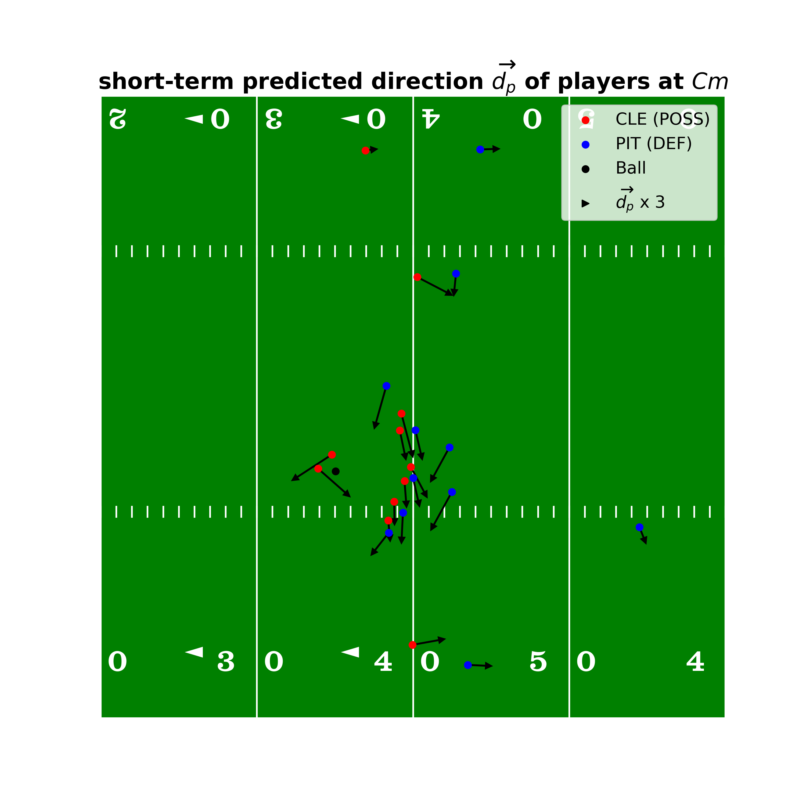
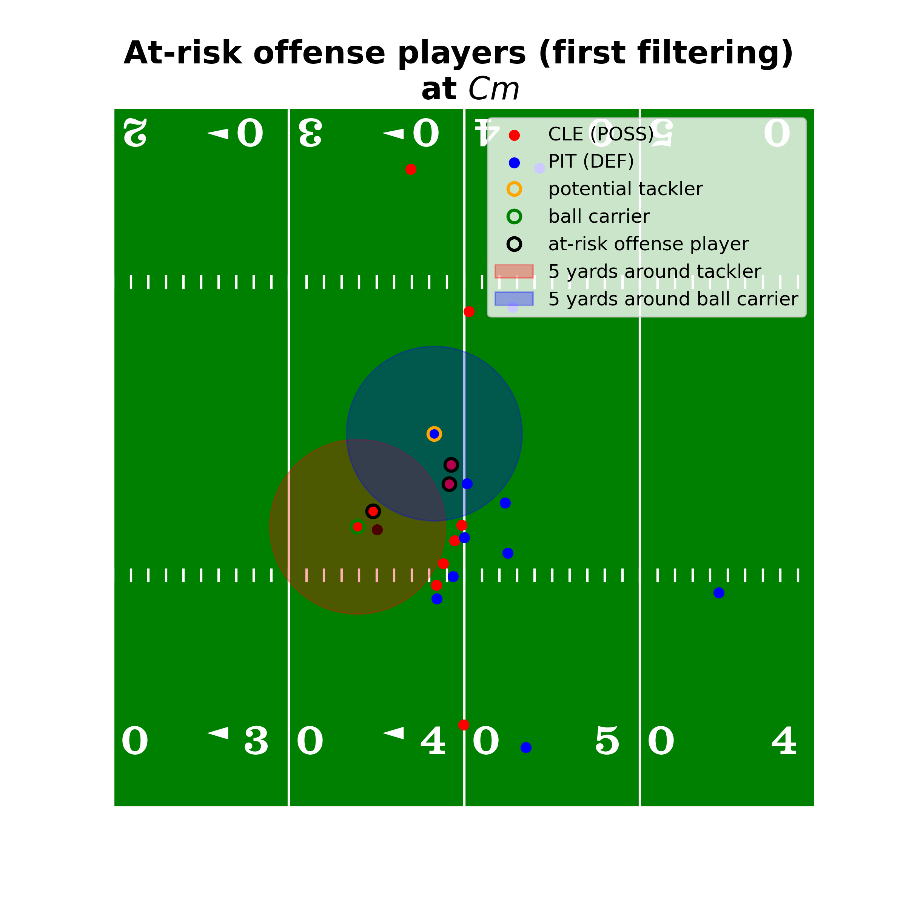
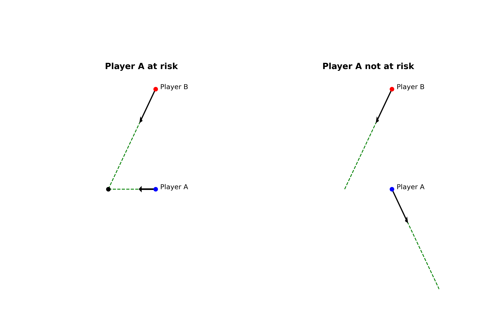
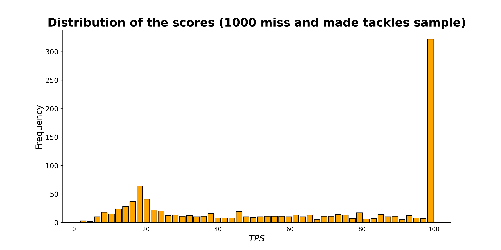
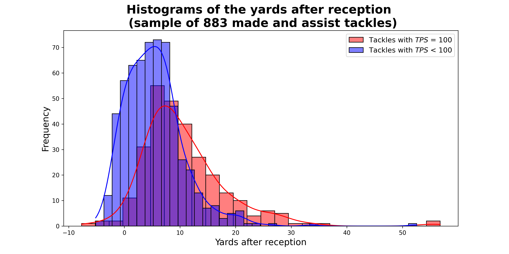
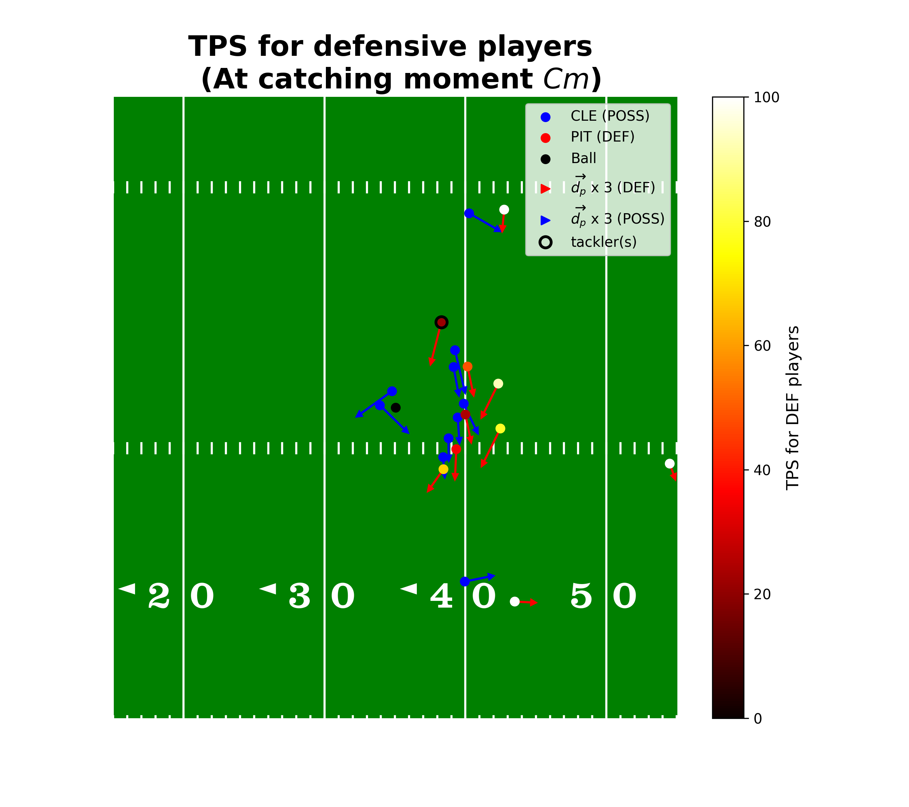
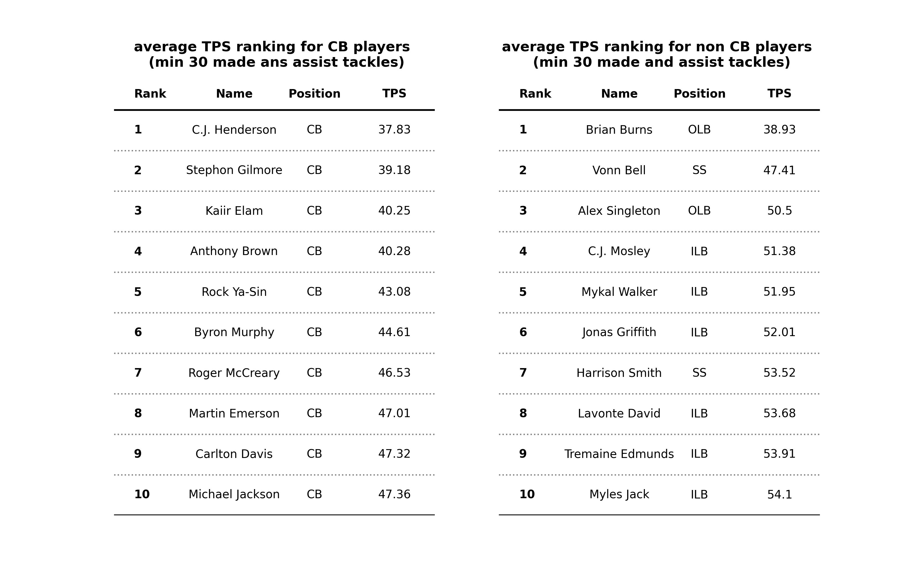

# Evaluating tackling position at catching moment

# Introduction and explanation of the idea

In the NFL, the objective of the defense is to give as few yards as possible to the opposing team. To achieve this, the defense must be optimally positioned to tackle the ball carrier as quickly as possible. Starting from this premise, we're going to attempt to create a metric that will enable us to evaluate the position of defenders to make a potential tackle when the ball carrier catches the ball. To achieve this, we will use the data provided as part of the <a href="https://www.kaggle.com/competitions/nfl-big-data-bowl-2024/data">"NFL Big Data Bowl 2024"</a>. 

To guide us in our work, we have focused on two essential elements in making a tackle:
- **The position of the defender from the offense players (except the ball carrier)**.
- **The position of the defender from the ball carrier**.

Our metric will therefore be divided into two parts, the first taking into account the position of the defender in relation to offense players (excluding the ball carrier), the second focusing on the position of the defender in relation to the ball carrier.

In this work, we will focus on the moment when the ball carrier catches the ball. To make our work easier, we'll call this moment the **"catching moment"**, which we'll name $Cm$.

---

# Create the metric

## Player information

To create our metric, we will need several pieces of information about each player on the field at the catching moment $Cm$. First, we'll need some basic information, then we'll create a new variable using information from the dataframes.

### Basic information

Here is the first information we will need:

- $x_{Cm}$ : The $x$ coordinate of the player at $Cm$.
- $y_{Cm}$ : The $y$ coordinate of the player at $Cm$.
- $s_{Cm}$ : The speed $s$ of the player at $Cm$.
- $a_{Cm}$ : The acceleration $a$ of the player at $Cm$.

Now that we have these four variables for each player, we'll create a fifth based on player direction.

### short-term predicted direction

We're going to determine the short-term predicted direction for each player. To do this, we'll need to predict the direction 0.1 seconds after the catching moment $Cm$. We call this moment $Cm+1$. We've decided to use degree-3 polynomial interpolation to predict this value. We will use data from the start of the action recording to the catching moment $Cm$.

The first step is to determine the two polynomials required, one for the $x$ axis and one for the $y$ axis. Each of these polynomial is of degree 3.

$$P_x(t) = a_{0}^x + a_{1}^x \cdot t + a_{2}^x \cdot t^{2} + a_{3}^x \cdot t^{3}$$
$$P_y(t) = a_{0}^y + a_{1}^y \cdot t + a_{2}^y \cdot t^{2} + a_{3}^y \cdot t^{3}$$

Then, we adjust the coefficients $a_{0}^x, a_{1}^x, a_{2}^x, a_{3}^x$ for the $x$ axis polynomial and $a_{0}^y, a_{1}^y, a_{2}^y, a_{3}^y$ for the $y$ axis polynomial by computing the sum of the mean squares $S_x$ and $S_y$ wich are given by :

$$ S_x = \sum_{i=0}^{Cm}(x_{i}-P(t_{i}))^{2} $$
$$ S_y = \sum_{i=0}^{Cm}(y_{i}-P(t_{i}))^{2} $$

When the coefficients are adjusted, we can compute the values $P_x$ and $P_y$ at the time $t_{Cm+1}$. This gives us two new information :
- $x_{Cm+1}$ : Equal to $P_x(t_{Cm+1})$, the $x$ coordinate of the player predicted at $Cm+1$.
- $y_{Cm+1}$ : Equal to $P_y(t_{Cm+1})$, the $y$ coordinate of the player predicted at $Cm+1$.

And, theses two new information alow us to have a new variable: the short-term predicted direction $\overrightarrow{d_p}$ of the player $p$.

$$\overrightarrow{d_p} = (x_{Cm+1}^{p} - x_{Cm}^{p}, y_{Cm+1}^{p} - y_{Cm}^{p})$$

We represent these directions in the example below. In this example, we multiply $\overrightarrow{d_p}$  by 3 to better observe the directions.

Now that we have all the variables we need for each player, we can start creating our metric.

---

## "Tackler - Offense players" $(TOP)$ metric

We start by computing the "Tackler - Offense players" metric. For this metric, we need to define the at-risk offense players for the potential tackler. To select these players, we'll perform two filtering steps.

### First step in filtering at-risk offense players

The first step is to keep offensive players at a distance from the potential tackler. Because we look at the action on the short term, we decide to keep the offense players that are positioned less than five yards around the ball carrier and five yards around the potential tackler.

Let $(x_{Cm}^T, y_{Cm}^T)$ be the coordinates of the potential tackler $T$ at $Cm$ and $(x_{Cm}^{O}, y_{Cm}^O)$ the coordinates of the offensive player $O$ at $Cm$. The offensive player is considered "at-risk" if :

$$\sqrt{(x_{Cm}^T - x_{Cm}^{O})^2 + (y_{Cm}^T - y_{Cm}^{O})^2} < 5$$

### Second step in filtering at-risk offense players

After this first step, we filter the at-risk offensive players a second time, keeping only those whose trajectory can meet that of the potential tackler. Here are the steps that will allow us to determine whether the trajectories of the two players can meet or not:
<ol>
    <li>
Define the parametric equations of the half-lines of the two players:
 
        The parametric equation of the potential tackler $T$ is defined by :
        $$\overrightarrow{r_T}(t) = \overrightarrow{P_{Cm}^T} + t \cdot \overrightarrow{d_T}$$
        Where :
        <ul>
            <li>$\overrightarrow{r_T}(t)$ is the position vector of any point on the half-line as a function of parameter $t$.</li>
            <li>$\overrightarrow{P_{Cm}^T} = (x_{Cm}^T, y_{Cm}^T)$</li>
            <li>$\overrightarrow{d_T} = (x_{Cm+1}^T - x_{Cm}^T, y_{Cm+1}^T - y_{Cm}^T)$</li>
        </ul>
         
        The parametric equation of the at-risk player $ARP$ is defined by :
        $$\overrightarrow{r_{ARP}}(u) = \overrightarrow{P_{Cm}^{ARP}} + u \cdot \overrightarrow{d_{ARP}}$$
        Where :
        <ul>
            <li>$\overrightarrow{r_{ARP}}(u)$ is the position vector of any point on the half-line as a function of parameter $u$.</li>
            <li>$\overrightarrow{P_{Cm}^{ARP}} = (x_{Cm}^{ARP}, y_{Cm}^{ARP})$</li>
            <li>$\overrightarrow{d_{ARP}} = (x_{Cm+1}^{ARP} - x_{Cm}^{ARP}, y_{Cm+1}^{ARP} - y_{Cm}^{ARP})$</li>
             
        </ul>
    </li>
   <li>
Solve the following system of equations:

        
       $$\overrightarrow{r_T}(t) = \overrightarrow{r_{ARP}}(u)$$
        
       $$\Leftrightarrow \begin{align}
  x_{Cm}^T + t \cdot (x_{Cm+1}^T - x_{Cm}^T) &= x_{Cm}^{ARP} + u \cdot (x_{Cm+1}^{ARP} - x_{Cm}^{ARP})\\
  y_{Cm}^T + t \cdot (y_{Cm+1}^T - y_{Cm}^T) &= y_{Cm}^{ARP} + u \cdot (y_{Cm+1}^{ARP} - y_{Cm}^{ARP})
\end{align}$$
    
   </li>
   <li>
Check system solutions:

        
       If the system has a solution with $t$ and $u$ greater than 0, then the two half-lines intersect at a common point. This means that the two players can cross paths and the at-risk offense player is keep, otherwise, we don't considere him anymore as a at-risk player.
   </li>
  
</ol>

### Define elements and create the $TOP$ metric

When we have our final list of $n_{ARP}$ at-rsik offense players, we define the elements that we're going to need for the metric.
- **The distance between the potential tackler $T$ and the at-risk offense player $k$, $ARP_k$, at $Cm$:**

$$ D_{(T, ARP_k)} = \sqrt{(x_{Cm}^T - x_{Cm}^{ARP_k})^2 + (y_{Cm}^T - y_{Cm}^{ARP_k})^2}$$

- **The speed difference between the potential tackler $T$ and the at-risk offense player $k$, $ARP_k$, at $Cm$:**

$$ \Delta S_{(T, ARP_k)} = s_{Cm}^{ARP_k} - s_{Cm}^{T}$$

- **The acceleration difference between the potential tackler $T$ and the at-risk offense player $k$, $ARP_k$, at the $Cm$:**

$$ \Delta A_{(T, ARP_k)} = a_{Cm}^{ARP_k} - a_{Cm}^{T}$$

- **The angle formed by the direction of the potential tackler $T$ and the at-risk offense player $k$, $ARP_k$, at $Cm$:**

$$ \theta_{(T, ARP_k)} = \frac{180}{\pi} \arccos \left(\frac{\overrightarrow{d_T}\cdot \overrightarrow{d_{ARP}}}{||\overrightarrow{d_T}||\cdot||\overrightarrow{d_{ARP}}||}\right)$$

Where :
   - $\overrightarrow{d_T}\cdot \overrightarrow{d_{ARP}}$ is the scalar product of vectors $\overrightarrow{d_T}$ and $\overrightarrow{d_{ARP}}$
   - $||\overrightarrow{d_T}||$ and $||\overrightarrow{d_{ARP}}||$ are the norms (lengths) of the vectors $\overrightarrow{d_T}$ and $\overrightarrow{d_{ARP}}$ respectively.

Now that we have these informations, we can compute the "Tackler - Offense players" ($TOP$) metric :

$$ TOP_T = \sum_{k=1}^{n_{ARP}} \frac{\left(\max(0,\Delta S_{(T, ARP_k)}) + \max(0,\Delta A_{(T, ARP_k)}) + \frac{\theta_{(T, ARP_k)}}{10}\right)}{D_{(T, ARP_k)}}\times 10$$

---

## "Tackler - Ball Carrier" $(TBC)$ metric

We now compute the "Tackler - Ball Carrier" ($TBC$) metric. For this metric, the directions of the potential tackler $T$ and the ball carrier $Bc$ will have an importance. We define a constant $c$ that is equal to 1 if the players' directions cross and 0 if not as we saw on [representation](#schema-crossing) earlier.

We define two variables related to the angle :
- **The angle between the potential tackler $T$ and the ball carrier $Bc$**

$$\theta_{(T, Bc)} = \begin{equation}
\begin{cases}
  \frac{180}{\pi} \arccos \left(\frac{\overrightarrow{d_T}\cdot \overrightarrow{d_{Bc}}}{||\overrightarrow{d_T}||\cdot||\overrightarrow{d_{Bc}}||}\right) \text{ if } c = 1\\
  0 \text{ if } c = 0
\end{cases}
\end{equation}$$
 
- **The opposite angle between the potential tackler $T$ and the ball carrier $Bc$**

$$
\theta_{\text{{opp}}{(T, Bc)}} = \begin{equation}
\begin{cases}
\frac{180}{\pi} \arccos \left(\frac{\overrightarrow{d}_{\text{{opp}}_{T}} \cdot \overrightarrow{d}_{\text{{opp}}_{Bc}}}{\|\overrightarrow{d}_{\text{{opp}}_{T}}\| \cdot \|\overrightarrow{d}_{\text{{opp}}_{Bc}}\|}\right) & \text{ if } c = 0 \\
0 & \text{ if } c = 1
\end{cases}
\end{equation}
$$

Where :
- $\overrightarrow{d_{opp_{T}}} = (x_{Cm}^{T} - x_{Cm+1}^{T}, y_{Cm}^{T} - y_{Cm+1}^{T})$
- $\overrightarrow{d_{opp_{Bc}}} = (x_{Cm}^{Bc} - x_{Cm+1}^{Bc}, y_{Cm}^{Bc} - y_{Cm+1}^{Bc})$

The other elements we're going to need for our metric are :
- **The distance between the potential tackler $T$ and the ball carrier $Bc$ at $Cm$:**

$$ D_{(T, Bc)} = \sqrt{(x_{Cm}^T - x_{Cm}^{Bc})^2 + (y_{Cm}^T - y_{Cm}^{Bc})^2}$$

- **The speed difference between the potential tackler $T$ and the ball carrier $Bc$ at $Cm$:**

$$ \Delta S_{(T, Bc)} = s_{Cm}^{Bc} - s_{Cm}^{T}$$

- **The acceleration difference between the potential tackler $T$ and the ball carrier $Bc$ at $Cm$:**

$$ \Delta A_{(T, Bc)} = a_{Cm}^{Bc} - a_{Cm}^{T}$$

Now that we have every element, we can compute the "Tackler - Ball Carrier" ($TBC$) metric :

$$ TBC_T = \exp{\left(\frac{D_{(T, Bc)}}{3}\right)} + \max\left(0, \Delta S_{(T, Bc)}\right) + \max\left(0, \Delta A_{(T, Bc)}\right) + c\left(\frac{180 - \theta_{(T, Bc)}}{10}\right) + (1-c)\left(\frac{\left(180-\theta_{{opp}_{(T, Bc)}}\right)\times D_{(T, Bc)}}{10}\right)$$

---

## Compute the final metric : the "Tackling position score" $(TPS)$

The final score for the potential tackler $T$ correspond to the sum of "Tackler - Offense players" metric and the "tackler - Ball Carrier" metric. We call this score the "Tacking position score" ($TPS_T$). Because of the high score we can have, we fix the score limt to 100.

$$ TPS_T  = \min(TOP_T + TBC_T, 100) $$

---

# How relevant is our metric ?

To check whether our metric is relevant, we'll look at player scores on a sample of 1000 tackles from the *tackle* dataframe. We consider our metric to be relevant if 2/3 or more of the players have a score below 100. 

In this sample, the number of successful and missed tackles with a $TPS$ of less than 100 is 683. This means that 68.3% of the tackles in our sample have a score below 100, confirming that our metric can be relevant.

Another thing we can do is look at the yards gained after catching the ball in relation to the scores for tackles with a $TPS$ of less than 100, and tackles with a $TPS$ of 100.

On this graph, we can see a high concentration of tackles with a $TPS$ of less than 100 between 0 and 8 yards. As for tackles with a $TPS$ equal to 100, their distribution is more spread out, with an average of around 8 yards. This representation confirms the relevance of our metric.

---

# Vizualize the players score on the play

To better understand the importance of our metric, we can represent the score for each player on the action. What we do is look at each player's score at $Cm$.

---

# Who are the best tacklers on short term ?

In this final section, we'll take a look at which defensive players make tackles in the best positions (with the best $TPS$). Because they are positioned so close to the attacking players, we decided to create a special ranking for cornerbacks and a second ranking for the other positions. Here are the results.

---

# Conclusion

To conclude, we have succeeded in creating a metric that allows us to better observe one aspect of the game: the moment when the ball carrier takes possession of the ball. This metric, which we have called the TPS, is based on the short term and can be used to award the fewest yards to the opposing team as quickly as possible. We could then try to make this metric more efficient using new data and artificial intelligence techniques.

Code available on <a href="https://github.com/BGorteau/NFL_Big_Data_Bowl_2024">GitHub</a>
